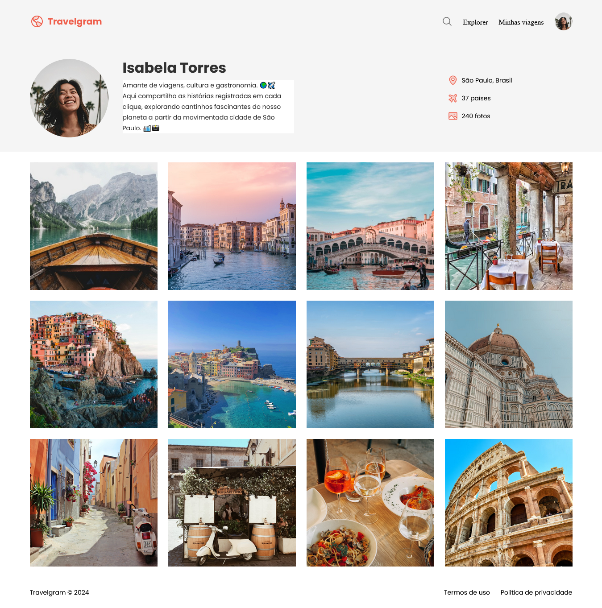

# Travelgram - Rocket Seat

A homepage of a travel website, featuring a profile picture, traveler's name and description, and an image gallery.

## Table of contents
- [Overview](#overview)
  - [Screenshot](#screenshot)
  - [Links](#-links)
- [My process](#my-process)
  - [Built with](#built-with)
  - [What I learned](#what-i-learned)
- [Authors](#authors)

## Overview

### Screenshot

## 🔗 Links

- Solution URL: [https://github.com/FYLIPI-2004/Travelgram](https://github.com/FYLIPI-2004/Travelgram)
- Live Site URL: [https://fylipi-2004.github.io/Travelgram/](https://fylipi-2004.github.io/Travelgram/)

## My process

### Built with

- Semantic HTML5 markup
- CSS custom properties
- Flexbox

## What I learned

How to use better the flexbox, so i can made a gallery of images!

## Authors

- [@FYLIPI-2004](https://github.com/FYLIPI-2004)
